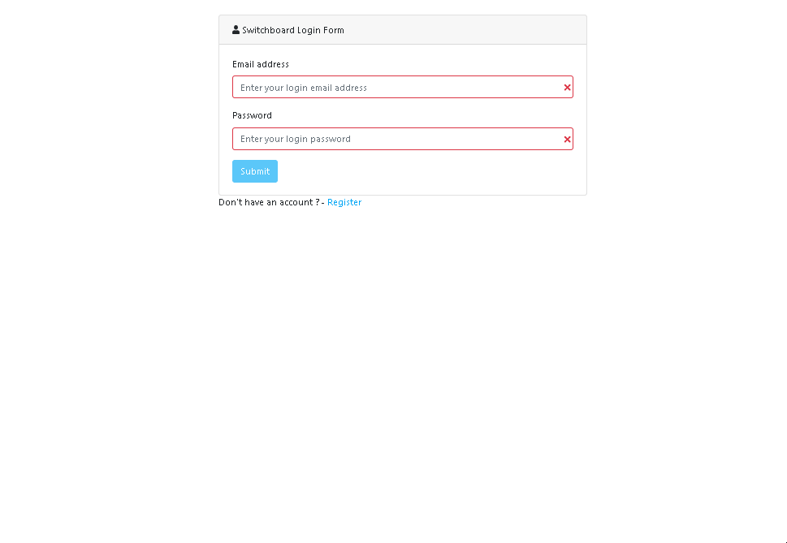

# Assignment 2 - IVR switchboard full stack (ReactJS App & API)
Name: Kevin Brennan

## Overview.
This a demonstration implementation of an IVR (Interactive Voice Response) switchboard full stack application using React and Node/Express with deployment to Heroku.  

### Features 
-  Simple full stack deployment to Heroku.
-  ReactJS front-end application which utilises react router, bootstrap & JWT authentication. 
-  NodeJS back-end which utilises Express, Mongo db (mongoose), File streaming from Mongo GridFS (testing supertest, mocha).

Note this is a 'wrapper' repository for deployment of the full stack to Heroku.  
Git subtree is used to import the separate [client](/footfish/ivrswitchboard-client) and [server](/footfish/ivrswitchboard-server) repositories.  
This readme focuses on Heroko deployment, follow the links below to read more on client or server.  
[Readme for client can be found here.](./client)  
[Readme for server can be found here.](/server)  



## Demo 
You can have a quick demo here (may be slow to spin up) [https://enigmatic-sea-61714.herokuapp.com/](https://enigmatic-sea-61714.herokuapp.com/)

email: dummy@email.com  
password: dummy  


## Installation requirements & Heroku deployment
The following instructions build the static react client and installs the node express router to serve the api and client. 

### Pre-requisites:
To deploy the full stack you will need to have a [heroku](https://www.heroku.com/) account and the heroku command line installed. 

### Get the code
Clone this repo locally. Then run `npm install` to install all required dependencies

### Mongo Db 
This application requires a mongo database. A free sandbox database is very straightforward to setup on heroku.  
*Note that heroku will require you to authenticate by registering a credit card*

```
heroku addons:create mongolab 
```
This will automatically create the database and set the required heroku environmental variable MONGODB_URI. 

### Environmental variables 
The application requires 3 environmental variables. 
  - MONGODB_URI: 
  - JWT_SECRET: 
  - REACT_APP_SERVER_URI:  
  
 MONGODB_URI is automatically configured, you will need to set the others from the command line. (*tip: `heroku config` lists variables set)
 
- **REACT_APP_SERVER_URI** - heroku host web url.  This is required for the the client build (so client can locate API). 

*heroku info* can be used to find the host web url. The below command should work to set it automatically on any *nix* cli. 

```
heroku config:set REACT_APP_SERVER_URI=$(heroku info -s | grep web_url | cut -d= -f2)
```

- **JWT_SECRET** - secret string used for java web token generation (auth) on server. 

```
heroku config:set JWT_SECRET=put-any-secret-here 
```

### Run local 
The following will run the full stack on localhost installed with test data (proxying the api).
You will need to make sure your server .env is correctly configured - [see readme for server](/server).  
(*Note: You may install a local database or use the heroku database configured (MONGODB_URI).*) 

Make sure you are in the codes root folder (ie. folder above ./server and ./client) then run;
```
npm run dev 
```

### Build and deploy 
```
git push heroku 
```

## Independent learning
-  Heroku 
-  Git subtree 

### Reference Material
-  Heroku Node.js Support - https://devcenter.heroku.com/articles/nodejs-support
-  git-subtree(1) Manual Page - file:///C:/Program%20Files/Git/mingw64/share/doc/git-doc/git-subtree.html
-  git subtrees: a tutorial - https://medium.com/@v/git-subtrees-a-tutorial-6ff568381844
-  Deploying a React app with React-Router and an Express Backend - https://dev.to/nburgess/creating-a-react-app-with-react-router-and-an-express-backend-33l3
-  How to Setup React and Node JS in a project - https://www.codementor.io/kakarganpat/how-to-setup-react-and-node-js-in-a-project-koxwqbssl
-  Let’s build a full stack MongoDB, React, Node and Express (MERN) app - https://medium.com/javascript-in-plain-english/full-stack-mongodb-react-node-js-express-js-in-one-simple-app-6cc8ed6de274
-  (Heroku) mLab MongoDB https://devcenter.heroku.com/articles/mongolab
-  https://www.npmjs.com/package/esm

