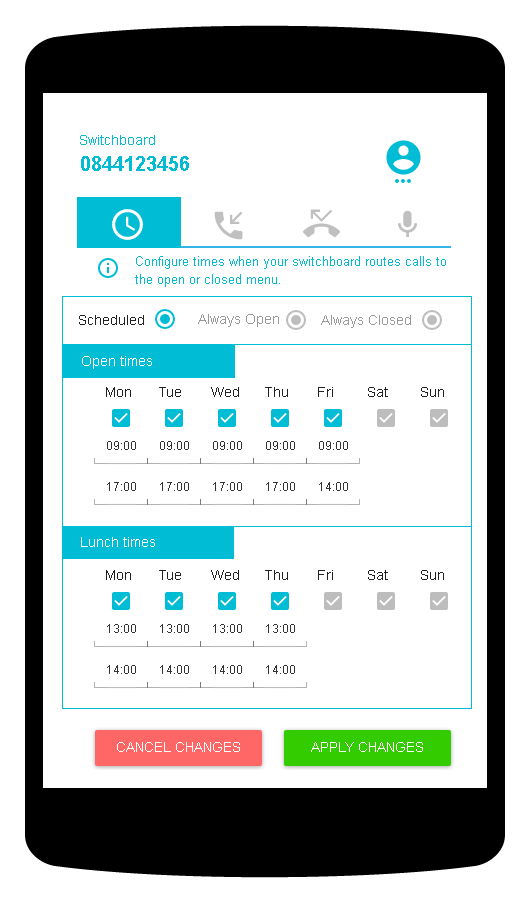
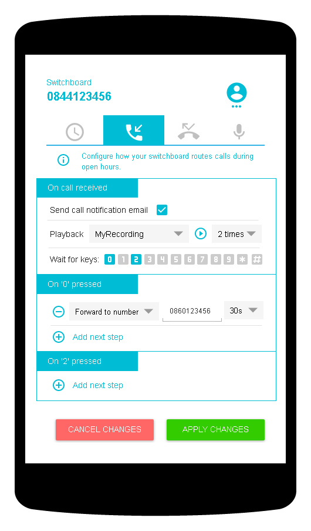
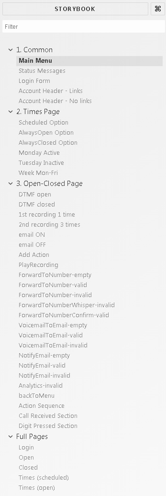
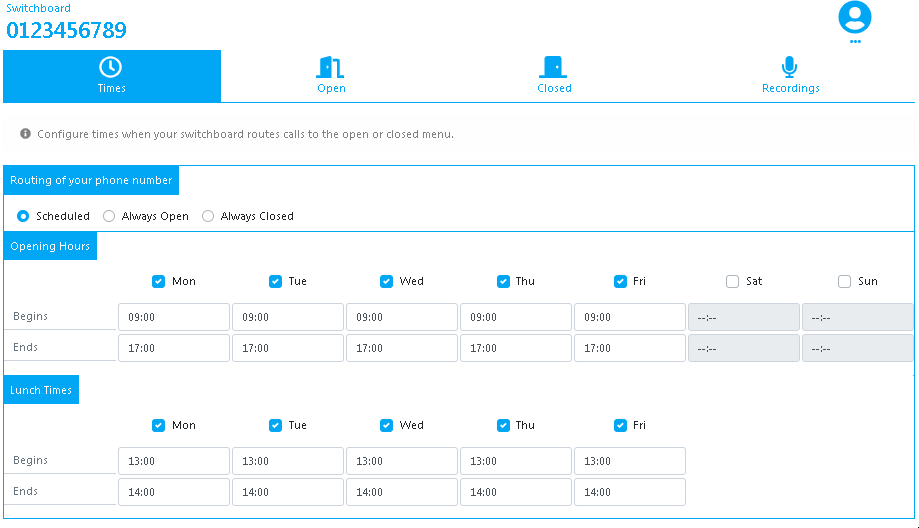
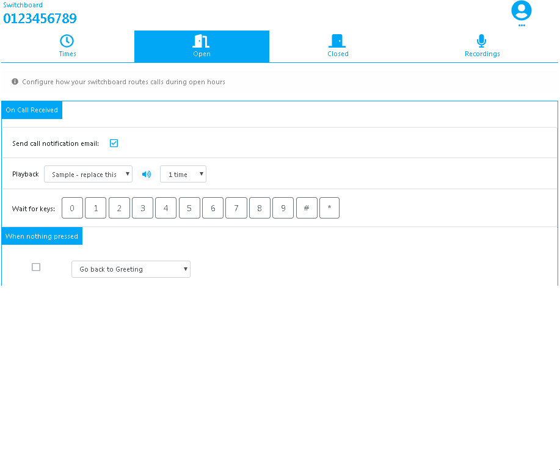
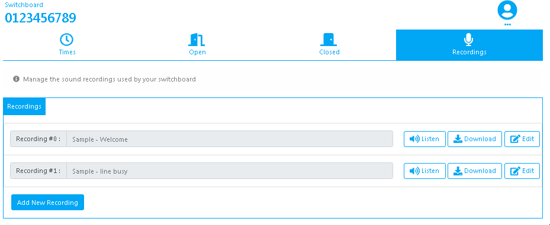

# Assignment 1 - ReactJS app.
React SPA. Enterprise Web Developement. MSc. in Computing (Enterprise Sofware	
Systems). 

Name: Kevin Brennan

## Overview.
This app is an IVR switchboard application. The user can build/manage call routing of a virtual phone number. The app consists of four main tabs; 
- *Times* - Where the user can build a schedule for call routing. 
- *Open* - The 'phone menu switchboard' which is used during the scheduled opening hours
- *Closed* - The 'phone menu switchboard' which is used during the scheduled closing hours
- *Recordings* - (not implemented) management of recordings used for playback. 

The app is a re-implementation of an active commercial switchboard server side application (no api). 
The app uses a 'page submit' approach which is most suitable for a live switchboard (allows review before activation).  
The objective is to test a suitable front-end SPA replacement for the commercial switchboard tested against a mock api. 

 ### User Features 
 
 + Mobile friendly
 + Route calls on a schedlule or overide to 'always open' / 'always closed'
 + Custom schedule for each day of the week with open and closing times plus lunch hour support. 
 + Separate call routing for open and closed menu. 
 + Add/Remove digits from the 'phone menu'
 + Add multiple menu actions in any sequence 'forward call, forward with whisper, forward with confirm, play recording, voicemail, email notifications, graph analytics). 
 + Playback sound recordings in the browser. 
 + Upload sound recordings (not implemented)

### Wireframe mockups 




## Installation requirements.

You can view a live demo over at [http://ec2-54-154-189-244.eu-west-1.compute.amazonaws.com/switchboardapp/]
(email/password - dummy@email.com/dummy )

To get the frontend running locally:

- Clone this repo
- npm install to install all req'd dependencies
- npm start to start the local server (this project uses create-react-app)

## Data Model Design.

API/Model uses sample json below. 
- *Times* tab renders number, routeOption & schedule 
- *Open* tab renders openMenu (and recordings where appropriate)
- *Closed* tab renders openMenu (and recordings where appropriate)

```javascript
"switchboard" : {
    "id" : "5f4aa4327dd1459f839a8237f97c8e52", //uid 
    "number": "084412314555", //phone number 
    "routeOption" : "scheduled",    //scheduled, alwaysOpen, alwaysClosed
    "schedule" : { // used if routeOption=scheduled
      "openHours": {  "mon": { "active": true, "begin": "09:00", "end": "17:00" },
                    "tue": { "active": true, "begin": "09:00", "end": "17:00" },
                    "wed": { "active": true, "begin": "09:00", "end": "17:00" },
                    "thu": { "active": true, "begin": "09:00", "end": "17:00" },
                    "fri": { "active": true, "begin": "09:00", "end": "13:00" },
                    "sat": { "active": false, "begin": "09:00", "end": "17:00" },
                    "sun": { "active": false, "begin": "09:00", "end": "17:00" }
                },
      "lunchHours": { "mon": { "active": true, "begin": "13:00", "end": "14:00" },
                    "tue": { "active": true, "begin": "13:00", "end": "14:00" },
                    "wed": { "active": true, "begin": "13:00", "end": "14:00" },
                    "thu": { "active": true, "begin": "13:00", "end": "14:00" },
                    "fri": { "active": false, "begin": "13:00", "end": "13:00" },
                    "sat": { "active": false, "begin": "09:00", "end": "17:00" },
                    "sun": { "active": false, "begin": "09:00", "end": "17:00" }
                }
    },    
    "openMenu" : { //menu when 'open' 
    "emailNotification": true,
    "greeting" : { "recordingId": 1, "times": 2 },
    "menu" : {   //'1', '2', .... '10' (star), '11'(hash), 'none'. 
      "1": [ { "action": "notifyEmail", "email": "bill@email.com", "label": "pressed_1" },
                  { "action": "forwardToNumberConfirm", "number": "0861234567", "ringTimer": 30 },
                  { "action": "analytics", "label": "one-pressed" }
                ],
      "3": [  { "action": "notifyEmail", "email": "steve@email.com", "label": "pressed_2" },
                { "action": "playRecording", "recordingId": 1 },
                { "action": "forwardToNumber", "number": "0861234568", "ringTimer": 30 }
              ],
      "none": [ { "action": "notifyEmail", "email": "bill@email.com", "label": "pressed_nothing" },
              { "action": "forwardToNumber", "number": "0861234567", "ringTimer": 30 },
              { "action": "analytics", "label": "none-pressed" },
              { "action": "backToMenu" }
             ]
            }
     },
     "closedMenu" : { //menu when 'closed' 
        "emailNotification": false,
        "greeting" : { "recordingId": 2, "times": 1 },
        "menu" : {   //'1', '2', .... '10' (star), '11'(hash), 'none'. 
          "none": [ { "action": "notifyEmail", "email": "bill@email.com", "label": "closed" },
                      { "action": "forwardToNumber", "number": "0861234567", "ringTimer": 30 }
                    ]
        }
      },
      "recordings" : [{ "label": "Recording 1", "src": "/greeting.mp3"} , 
                      { "label": "Recording 2", "src": "/open.mp3"},
                      {"label": "Recording 3", "src": "/closed.mp3"}]
}
```

## App Component Design.



## UI Design.

- **UI Times tab shown with a schedule active**


- **UI Open tab showing digit '1' active on the menu with various actions**


- **UI Recordings tab**


## Routing.

+ /login - login view 
+ /times - shows 'times' tab (protected)
+ /open  - shows 'open' tab (protected)
+ /closed  - shows 'closed' tab (protected)
+ /recordings  - shows 'recordings' tab placeholder (protected)
+ /account - - shows 'account details' placeholder (protected)
+ /billing - - shows 'billing statement' placeholder (protected)
+ /payment - - shows 'payment settings' placeholder (protected)

## Extra features

- Theming with bootstrap 

- API with JWT auth [API code here](https://github.com/footfish/ivrswitchboard/blob/master/src/lib/SwitchboardAPI.js)  

- Mock api testing using json-server & jsonwebtoken. Note: Simulated delay of 2s for API calls. 
  Can be reached on http://ec2-54-154-189-244.eu-west-1.compute.amazonaws.com/switchboard/

- Audio tags use custom fontAwsome icon and ref's ( ref={audioTag} ) for playback. 

- Forms all support reg expression validation higlighting, (real api server side api will provide submission validatation). 


## Independent learning.

- working of REST API's 
- JWT authentication 
- json-server & json webtoken 
- bootstrap css 

## References used 
A Firebase in React Tutorial for Beginners 
[https://www.robinwieruch.de/complete-firebase-authentication-react-tutorial/]

Input time
[https://developer.mozilla.org/en-US/docs/Web/HTML/Element/input/time#Handling_browser_support]

React Global State without Redux
[https://www.robinwieruch.de/react-global-state-without-redux/]

React Docs
[https://reactjs.org/docs/]

React Tutorial
[https://reactjs.org/tutorial/tutorial.html]

storybook quick start guide
[https://storybook.js.org/basics/quick-start-guide/]

Learn storybook
[https://www.learnstorybook.com/react/en/get-started]

Graphql react tutorial
[https://blog.hichroma.com/graphql-react-tutorial-part-1-6-d0691af25858]

Better Understanding Forms in React
[https://medium.com/javascript-inside/better-understanding-forms-in-react-a85d889773ce]

Theming Bootstrap   
[https://getbootstrap.com/docs/4.3/getting-started/theming/]

Adding Bootstrap to React
[https://facebook.github.io/create-react-app/docs/adding-bootstrap]

React fontawesome
[https://github.com/FortAwesome/react-fontawesome]

React router
[https://github.com/ReactTraining/react-router]

Getting started with react router
[https://codeburst.io/getting-started-with-react-router-5c978f70df91]

Understanding react state
[https://css-tricks.com/understanding-react-setstate/]

Fetch
[https://developer.mozilla.org/en-US/docs/Web/API/Fetch_API]

How to Use the JavaScript Fetch API to Get Data
[https://scotch.io/tutorials/how-to-use-the-javascript-fetch-api-to-get-data]

Json server
[https://www.npmjs.com/package/json-server]

Building a Fake and JWT Protected REST API with json-server
[https://www.techiediaries.com/fake-api-jwt-json-server/]

Get Started with JSON Web Tokens
[https://auth0.com/learn/json-web-tokens/]

Authentication For Your React and Express Application w/ JSON Web Tokens
[https://medium.com/@faizanv/authentication-for-your-react-and-express-application-w-json-web-tokens-923515826e0]

How I set up React and Node with JSON Web Token for Authentication
[https://medium.com/@romanchvalbo/how-i-set-up-react-and-node-with-json-web-token-for-authentication-259ec1a90352]

Deployment
[https://facebook.github.io/create-react-app/docs/deployment]


